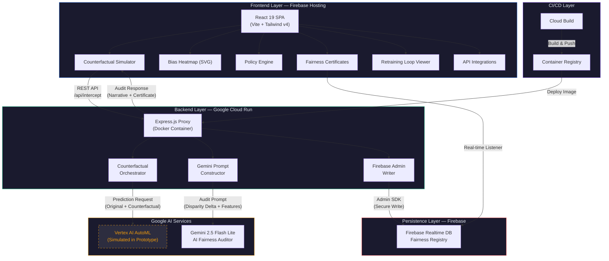
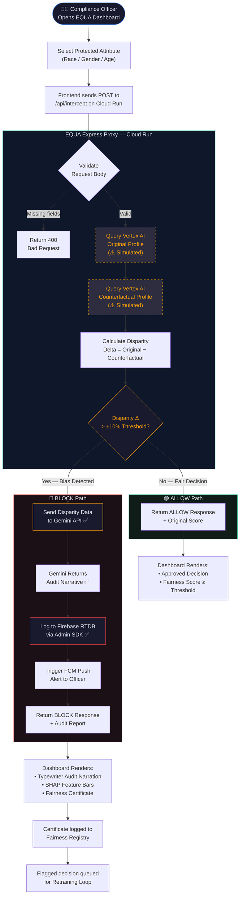
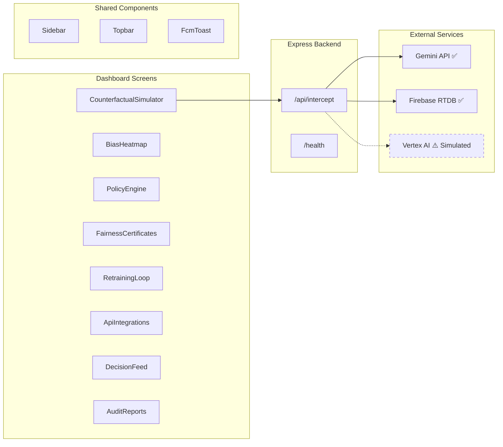

# System Architecture: EQUA AI Bias Firewall

EQUA is architected as a high-performance, ethical interceptor that sits between consumer applications and AI decision endpoints. This document details the system architecture, low-latency proxy logic, and the synchronization between the React frontend and the Cloud Run backend.

---

## ⚠️ Vertex AI Simulation Assumption

> **Important:** In the current prototype, the Vertex AI prediction endpoint is **simulated**. The counterfactual simulation logic (baseline scoring, counterfactual scoring, and SHAP feature attribution) is performed using deterministic client-side data to demonstrate the complete interception lifecycle without incurring Vertex AI inference costs. The Gemini API integration and Firebase RTDB logging are **fully live**. The architecture is designed for seamless Vertex AI endpoint integration — the `@google-cloud/aiplatform` SDK is already included in the backend dependencies (`package.json`), and the Express proxy is structured to replace the simulation with real `aiplatform.googleapis.com` prediction calls in production.

---

## 🏗️ System Architecture Diagram

The following diagram shows the high-level component architecture of EQUA, illustrating how each layer communicates and the Google Cloud services powering each component.

> **Legend:** The dashed border on "Vertex AI AutoML" indicates that this component is simulated in the current prototype. All other connections are live.

---

## 🏗️ Core Architecture Components

The system is split into four distinct layers to ensure security, scalability, and auditability.

### 1. EQUA Dashboard (Frontend - Firebase Hosting)
The command center for compliance officers.
- **Tech Stack:** React 19, Vite, Tailwind v4.
- **Role:** Visualizes real-time interceptions, renders bias heatmaps using raw SVGs, and provides the Policy Engine for defining fairness thresholds.
- **Communication:** Communicates with the EQUA Backend via secure REST endpoints.

### 2. EQUA Express Proxy (Backend - Google Cloud Run)
The security and orchestration engine.
- **Tech Stack:** Node.js, Express, Docker.
- **Role:** Acts as the secure bridge. It hosts sensitive API keys (Gemini) and manages the multi-step counterfactual simulation flow.
- **Security:** By centralizing AI calls here, we prevent the exposure of Generative AI credentials to the client-side browser.
- **Vertex AI Note:** The backend includes `@google-cloud/aiplatform` as a dependency and is pre-structured to replace the simulated scoring with real Vertex AI AutoML prediction calls. The counterfactual orchestration logic (sending two prediction requests with swapped protected attributes) is already implemented in the proxy — only the prediction client needs to be switched from simulation to live.

### 3. AI Fairness Auditor (Google Gemini 2.5 API)
The reasoning engine for compliance.
- **Model:** `gemini-2.5-flash-lite`.
- **Role:** When a decision is blocked, the backend sends a structured audit request to Gemini. Gemini translates mathematical disparity into a human-readable audit narrative and suggests specific ML remediations.
- **Status:** ✅ **LIVE** — Real Gemini API calls are made from the Cloud Run backend.

### 4. Fairness Registry (Real-time Persistence - Firebase RTDB)
The source of truth for audits.
- **Integration:** Firebase Admin SDK.
- **Role:** Every blocked decision is logged with a timestamp, applicant metadata, and the Gemini-generated audit narrative into a real-time, production-grade database.
- **Status:** ✅ **LIVE** — Real Firebase Admin SDK writes are executed server-side.

### 5. Vertex AI AutoML Endpoint (Simulated)
The target AI model being audited.
- **Intended Role:** Hosts the ML model (e.g., loan approval, hiring) that EQUA intercepts. The proxy sends two prediction requests — one with the original profile and one with swapped protected attributes — to compute the disparity delta.
- **Current Status:** ⚠️ **SIMULATED** — The prototype uses deterministic scoring logic to generate consistent demo data (e.g., original score 91.4, counterfactual score 61.8) that demonstrates the full interception workflow. This approach was chosen to avoid Vertex AI inference costs during the hackathon while still showcasing the complete architectural flow.
- **Production Path:** Replace the simulation function in `server.js` with authenticated calls to `aiplatform.googleapis.com/v1/projects/{project}/locations/{location}/endpoints/{endpoint}:predict`.

---

## 🔄 The Interception Lifecycle

The following sequence diagram illustrates how EQUA intercepts a biased loan decision in real-time.

```mermaid
sequenceDiagram
    participant App as React Frontend
    participant Proxy as EQUA Backend (Cloud Run)
    participant AI as Vertex AI Model (Simulated)
    participant Gemini as Gemini 2.5 Auditor
    participant DB as Firebase RTDB

    App->>Proxy: 1. Request Inference

    rect rgb(20, 20, 30)
    Note over Proxy: Counterfactual Orchestration
    Proxy->>AI: 2. Baseline Request (Original)
    AI-->>Proxy: 3. Return Score (91.4 - Approved)

    Proxy->>AI: 4. Counterfactual Request (Swap Gender/Race)
    AI-->>Proxy: 5. Return Score (61.8 - Denied)
    end

    Proxy->>Proxy: 6. Detect Disparity (Δ = -29.6)

    alt Disparity > Threshold (±10)
        Proxy->>Gemini: 7. Request Narrative Audit ✅ LIVE
        Gemini-->>Proxy: 8. Return Audit + ML Fix ✅ LIVE
        Proxy->>DB: 9. Securely Log Decision (Admin SDK) ✅ LIVE
        Proxy-->>App: 10. BLOCK (Return Audit Report)
    else Disparity within Threshold
        Proxy-->>App: 7. ALLOW (Return Baseline Score)
    end
```

> **Note:** Steps marked ✅ LIVE are real API calls in the current prototype. Steps 2-5 involving the Vertex AI Model are simulated with deterministic data. The architecture supports replacing the simulation with live Vertex AI calls without modifying the overall flow.

---

## 🔁 Process Flow Diagram

The following flowchart illustrates the end-to-end decision process from the moment a user triggers an AI inference request to the final ALLOW/BLOCK outcome.

**Process Flow Summary:**

1. **User Action** — Compliance officer selects a protected attribute (Race, Gender, or Age) on the Counterfactual Simulator screen.
2. **API Request** — Frontend sends a POST request to `/api/intercept` on the Cloud Run backend with applicant data and the selected attribute.
3. **Validation** — The Express proxy validates required fields (`name`, `activeToggle`). Returns 400 if invalid.
4. **Counterfactual Simulation** — The proxy queries the AI model twice: once with the original profile and once with the demographic attribute swapped. *(⚠️ Simulated in prototype with deterministic scores.)*
5. **Disparity Detection** — The proxy calculates the delta between the two scores. If the delta exceeds the ±10% policy threshold, the decision is flagged.
6. **BLOCK Path** — Gemini generates an audit narrative ✅, the decision is logged to Firebase RTDB ✅, an FCM alert is triggered, and the dashboard renders the full audit report with typewriter animation.
7. **ALLOW Path** — If the disparity is within the threshold, the original decision is returned as fair and the dashboard renders the approved state.

## 🛡️ Security Posture

### Backend-to-Backend Orchestration
EQUA follows the **Backend-for-Frontend (BFF)** pattern. No AI calls are made directly from the user's browser. This ensures that:
1. **API Keys are Hidden:** The Gemini and Firebase keys are injected into the Cloud Run environment and never reach the client.
2. **Rate Limiting:** The Express backend can implement throttling and caching to protect the underlying AI services.
3. **Audit Integrity:** Writes to the Fairness Registry are performed via the **Firebase Admin SDK**, which operates with full server-side privileges, ensuring logs cannot be tampered with by client-side scripts.

---

## ⚡ Zero-Latency Rendering

A core design principle of EQUA is the **Zero-Latency Dashboard**.

1. **SVG over Canvas:** We chose SVGs for our data visualizations because they are part of the DOM, allowing us to use CSS keyframes for animations. This offloads animation work to the GPU, keeping the main thread free for AI inference logic.
2. **Atomic State Updates:** The Retraining Loop and Policy Engine use atomic state updates to ensure only the necessary components re-render when a threshold is changed, preventing UI stutter during simulation.
3. **Optimized Bundle:** The production bundle is deployed via **Firebase Hosting**, leveraging Google's global CDN to ensure the firewall dashboard loads instantly for Solution Challenge judges worldwide.

---

## 📊 Component-Level Architecture

