# System Architecture

EQUA is engineered as an **"Ethical Infrastructure" middleware proxy**. It is designed to sit between client applications (e.g., a bank's loan approval portal, a hospital's triage system, or an HR recruitment dashboard) and the underlying Machine Learning inference endpoints (e.g., models deployed on Google Vertex AI).

The core philosophy of EQUA is **Zero-Trust for AI Bias**. Instead of trusting the model's output implicitly, EQUA mathematically proves the fairness of the decision before it is allowed to reach the end-user.

---

## 🏗️ Architecture Diagram

The following Mermaid diagram illustrates the exact real-time data flow when a decision is intercepted by the EQUA firewall.

```mermaid
sequenceDiagram
    participant Client as Client Application
    participant Proxy as EQUA Firewall Proxy
    participant AI as Vertex AI Endpoint
    participant Gemini as Gemini 2.0 API
    participant Registry as Fairness Registry (KMS)

    Client->>Proxy: 1. Request AI Inference (User Data)
    Proxy->>AI: 2. Forward Initial Request
    AI-->>Proxy: 3. Return Initial Decision (e.g. Score: 91.4)
    
    rect rgb(30, 30, 40)
    Note over Proxy: 4. Counterfactual Simulation Phase
    Proxy->>Proxy: Identify Protected Attributes (Race, Gender, Age)
    Proxy->>Proxy: Swap Attributes (e.g. Male -> Female)
    end

    Proxy->>AI: 5. Forward Counterfactual Request
    AI-->>Proxy: 6. Return Counterfactual Decision (e.g. Score: 61.8)
    
    Proxy->>Proxy: 7. Calculate Disparity Delta (Δ = -29.6)
    
    alt Disparity Δ > Policy Threshold (e.g. ±10%)
        Proxy->>Gemini: 8. Send Delta & Features for Audit
        Gemini-->>Proxy: 9. Return Compliance Narrative & ML Fix
        Proxy->>Registry: 10. Log Decision & Generate Cryptographic Hash
        Proxy-->>Client: 11. BLOCK Transaction (Return Audit Report)
    else Disparity Δ ≤ Policy Threshold
        Proxy-->>Client: 8. ALLOW Transaction (Return Initial Decision)
    end
```

---

## ⚙️ Detailed Component Breakdown

### 1. The Interception Proxy Layer
The proxy layer acts as the gatekeeper. It receives incoming JSON payloads containing the user's features (e.g., Credit Score, Income, Age, Gender). Instead of routing this directly back to the client after inference, it holds the connection open, intercepting the payload for the **Counterfactual Engine**.

### 2. The Counterfactual Engine
This is the mathematical core of EQUA. It performs what is known as "Counterfactual Fairness Testing."
- **Attribute Isolation:** It identifies protected classes defined by the EEOC or EU AI Act (e.g., Race, Age, Gender).
- **Profile Cloning:** It creates a cloned version of the applicant's payload, altering *only* the protected attribute.
- **Delta Calculation:** It queries the AI model with both the original and cloned payloads. It then subtracts the Counterfactual Score from the Original Score to find the `Decision Probability Δ`.
- **Latency Optimization:** To ensure this process doesn't bottleneck the client application, the EQUA UI is heavily optimized using raw SVGs and CSS animations, avoiding heavy JS charting libraries that block the main thread.

### 3. The Policy Engine
The Policy Engine dictates the rules of engagement. Compliance officers use interactive sliders to set the acceptable **Action Threshold** (e.g., ±10%). 
- If the `Decision Probability Δ` falls within the threshold, the firewall allows the transaction to proceed.
- If the `Δ` exceeds the threshold, the firewall triggers a hard **BLOCK**, simulating a zero-trust network block.

### 4. Gemini Fairness Auditor Integration
When a decision is blocked, EQUA must explain *why* to satisfy the "Right to Explanation" clauses in modern AI legislation.
- **The Prompt:** EQUA constructs a highly structured prompt containing the applicant's name, the swapped attribute, the original score, and the counterfactual score.
- **The Generation:** It sends this to the `gemini-2.0-flash-lite` model via the `@google/generative-ai` SDK.
- **The Output:** Gemini acts as an AI Fairness Auditor, streaming back a real-time, human-readable compliance narrative. It explicitly details how the model penalized the user based on the correlated attribute, and provides technical ML remediation suggestions (e.g., "Remove proxy variable X").

### 5. Fairness Certificates & KMS (Simulated)
Blocked decisions cannot just be discarded; they must be logged for regulatory audits.
- **The Registry:** EQUA logs the blocked decision into a persistent UI ledger.
- **Cryptographic Hashing:** To simulate enterprise-grade non-repudiation, EQUA generates a cryptographic hash of the audit report, simulating integration with **Google Cloud Key Management Service (KMS)**. This ensures that the audit log cannot be tampered with after the fact.

### 6. The Retraining Loop (Vertex AI Ecosystem)
EQUA isn't just a blocker; it's part of a continuous improvement pipeline. The "Retraining Loop" dashboard visualizes how the blocked data is aggregated and exported to **Google BigQuery**. Once enough bias drift is detected, EQUA simulates triggering a **Vertex AI pipeline** to automatically retrain the underlying model using constrained datasets, closing the loop on algorithmic bias.

---

## 🌐 Deployment Stack
- **Frontend:** React 19 + Vite for ultra-fast Hot Module Replacement and minimal production bundle sizes.
- **Styling:** Tailwind CSS v4, utilizing a strict "Ethical Infrastructure" design system (Dark mode, IBM Plex Mono, high-contrast alerts).
- **Hosting:** The production bundle is deployed via **Firebase Hosting**, leveraging Google's global CDN to ensure the firewall dashboard loads instantly for Solution Challenge judges worldwide.
