# System Architecture: EQUA AI Bias Firewall

EQUA is architected as a high-performance, ethical interceptor that sits between consumer applications and AI decision endpoints. This document details the low-latency proxy logic and the synchronization between the React frontend and the Cloud Run backend.

## 🏗️ Core Architecture Components

The system is split into four distinct layers to ensure security, scalability, and auditability.

### 1. EQUA Dashboard (Frontend - Firebase Hosting)
The command center for compliance officers.
- **Tech Stack:** React 19, Vite, Tailwind v4.
- **Role:** Visualizes real-time interceptions, renders bias heatmaps using raw SVGs, and provides the Policy Engine for defining fairness thresholds.
- **Communication:** Communicates with the EQUA Backend via secure REST endpoints.

### 2. EQUA Express Proxy (Backend - Google Cloud Run)
The security and orchestration engine.
- **Tech Stack:** Node.js, Express, Docker.
- **Role:** Acts as the secure bridge. It hosts sensitive API keys (Gemini) and manages the multi-step counterfactual simulation flow.
- **Security:** By centralizing AI calls here, we prevent the exposure of Generative AI credentials to the client-side browser.

### 3. AI Fairness Auditor (Google Gemini 2.5 API)
The reasoning engine for compliance.
- **Model:** `gemini-2.5-flash-lite`.
- **Role:** When a decision is blocked, the backend sends a structured audit request to Gemini. Gemini translates mathematical disparity into a human-readable audit narrative and suggests specific ML remediations.

### 4. Fairness Registry (Real-time Persistence - Firebase RTDB)
The source of truth for audits.
- **Integration:** Firebase Admin SDK.
- **Role:** Every blocked decision is logged with a timestamp, applicant metadata, and the Gemini-generated audit narrative into a real-time, production-grade database.

---

## 🔄 The Interception Lifecycle

The following sequence diagram illustrates how EQUA intercepts a biased loan decision in real-time.

```mermaid
sequenceDiagram
    participant App as React Frontend
    participant Proxy as EQUA Backend (Cloud Run)
    participant AI as Vertex AI Model
    participant Gemini as Gemini 2.5 Auditor
    participant DB as Firebase RTDB

    App->>Proxy: 1. Request Inference
    
    rect rgb(20, 20, 30)
    Note over Proxy: Counterfactual Orchestration
    Proxy->>AI: 2. Baseline Request (Original)
    AI-->>Proxy: 3. Return Score (91.4 - Approved)
    
    Proxy->>AI: 4. Counterfactual Request (Swap Gender/Race)
    AI-->>Proxy: 5. Return Score (61.8 - Denied)
    end

    Proxy->>Proxy: 6. Detect Disparity (Δ = -29.6)

    alt Disparity > Threshold (±10)
        Proxy->>Gemini: 7. Request Narrative Audit
        Gemini-->>Proxy: 8. Return Audit + ML Fix
        Proxy->>DB: 9. Securely Log Decision (Admin SDK)
        Proxy-->>App: 10. BLOCK (Return Audit Report)
    else Disparity within Threshold
        Proxy-->>App: 7. ALLOW (Return Baseline Score)
    end
```

---

## 🛡️ Security Posture

### Backend-to-Backend Orchestration
EQUA follows the **Backend-for-Frontend (BFF)** pattern. No AI calls are made directly from the user's browser. This ensures that:
1. **API Keys are Hidden:** The Gemini and Firebase keys are injected into the Cloud Run environment and never reach the client.
2. **Rate Limiting:** The Express backend can implement throttling and caching to protect the underlying AI services.
3. **Audit Integrity:** Writes to the Fairness Registry are performed via the **Firebase Admin SDK**, which operates with full server-side privileges, ensuring logs cannot be tampered with by client-side scripts.

---

## ⚡ Zero-Latency Rendering

A core design principle of EQUA is the **Zero-Latency Dashboard**.

1. **SVG over Canvas:** We chose SVGs for our data visualizations because they are part of the DOM, allowing us to use CSS keyframes for animations. This offloads animation work to the GPU, keeping the main thread free for AI inference logic.
2. **Atomic State Updates:** The Retraining Loop and Policy Engine use atomic state updates to ensure only the necessary components re-render when a threshold is changed, preventing UI stutter during simulation.
3. **Optimized Bundle:** The production bundle is deployed via **Firebase Hosting**, leveraging Google's global CDN to ensure the firewall dashboard loads instantly for Solution Challenge judges worldwide.

