<div align="center">
  <h1>🛡️ EQUA: AI Bias Firewall</h1>
  <p><strong>A zero-latency, real-time proxy firewall intercepting demographic bias in AI models before decisions reach the user.</strong></p>
  <p><i>Built for the Google Solution Challenge 2026</i></p>

  [](https://react.dev/)
  [](https://expressjs.com/)
  [](https://ai.google.dev/)
  [](https://cloud.google.com/run)
  [](https://firebase.google.com/)
  [](https://www.docker.com/)
</div>

---

## 🌍 The Problem: Black-Box Bias
As artificial intelligence rapidly scales to handle critical human infrastructure—loan approvals, hiring, healthcare triage, and criminal justice—we are facing a crisis of **algorithmic bias**. Machine learning models often inherit historical prejudices, penalizing users based on protected demographic attributes (Race, Gender, Age) through hidden proxy variables (e.g., zip codes, employment history).

Because these models act as "black boxes," it is nearly impossible for organizations to intercept a biased decision *before* it negatively impacts a human life. Existing MLOps tools analyze bias *after* the fact (data drift monitoring), which is too late to prevent discriminatory harm.

## 🛡️ The Solution: EQUA
**EQUA is an Ethical Infrastructure proxy firewall.** 
It sits as a lightning-fast middleware layer between the client application and the target AI Model (e.g., Vertex AI endpoints). Before any AI decision is returned to the user, EQUA mathematically audits it in real-time.

Using **Counterfactual Identity Simulation**, EQUA instantly clones the user's profile, swaps their protected attributes (e.g., changing male to female), and re-queries the model. If the AI changes its decision solely based on that demographic swap, EQUA **blocks** the transaction, logs a real-time Fairness Certificate to **Firebase RTDB**, and generates a compliance audit using **Google Gemini 2.5 Flash Lite**.

---

## 🧠 Powered by the Google Ecosystem

EQUA heavily leverages Google Cloud and AI to deliver a production-grade firewall:

- **Google Gemini API (`gemini-2.5-flash-lite`):** Acts as the real-time AI Fairness Auditor. Our Express backend securely orchestrates inference, constructing prompts with mathematical disparity deltas to generate human-readable compliance narratives.
- **Google Cloud Run:** Hosts our containerized Express.js backend, providing auto-scaling, high availability, and a secure environment for our API keys.
- **Firebase Realtime Database & Admin SDK:** Provides the persistence layer for the Fairness Registry. All blocked decisions are securely logged server-side via the Admin SDK for non-repudiable auditing.
- **Google Cloud Build:** Automates our CI/CD pipeline, ensuring that every push to the repository is tested, containerized, and deployed to Cloud Run.
- **Firebase Hosting:** Serves the optimized React frontend with global low-latency.

*(See our [GOOGLE_SERVICES.md](./GOOGLE_SERVICES.md) for full technical details).*

---

## 🏗️ System Architecture & Data Flow

EQUA's architecture relies on a strict zero-trust approach to algorithmic inference, now fortified with a secure backend proxy.

```mermaid
sequenceDiagram
    participant Client as React Frontend
    participant Proxy as EQUA Express Proxy (Cloud Run)
    participant AI as Vertex AI Endpoint
    participant Gemini as Gemini 2.5 API
    participant RTDB as Firebase Realtime DB

    Client->>Proxy: 1. Request AI Inference (User Data)
    Proxy->>AI: 2. Forward Initial Request
    AI-->>Proxy: 3. Return Initial Decision (e.g. Score: 91.4)
    
    rect rgb(30, 30, 40)
    Note over Proxy: 4. Counterfactual Simulation Phase
    Proxy->>Proxy: Identify Protected Attributes (Race, Gender, Age)
    Proxy->>Proxy: Swap Attributes (e.g. Male -> Female)
    end

    Proxy->>AI: 5. Forward Counterfactual Request
    AI-->>Proxy: 6. Return Counterfactual Decision (e.g. Score: 61.8)
    
    Proxy->>Proxy: 7. Calculate Disparity Delta (Δ = -29.6)
    
    alt Disparity Δ > Policy Threshold (e.g. ±10%)
        Proxy->>Gemini: 8. Send Delta & Features for Audit
        Gemini-->>Proxy: 9. Return Compliance Narrative & ML Fix
        Proxy->>RTDB: 10. Log Decision (Admin SDK)
        Proxy-->>Client: 11. BLOCK Transaction (Return Audit Report)
    else Disparity Δ ≤ Policy Threshold
        Proxy-->>Client: 8. ALLOW Transaction (Return Initial Decision)
    end
```



*(See our [ARCHITECTURE.md](./ARCHITECTURE.md) for a deep dive into the proxy logic).*

---

## ✨ Core Capabilities

- **⚡ Real-Time Counterfactual Simulator**
  Instantly swap protected demographic attributes (Gender, Race, Age) and watch the simulated model's decision shift. 
- **📜 Fairness Certificates (Firebase Integrated)**
  Blocked decisions are permanently logged into a real-time registry on Firebase, providing a production-grade audit trail.
- **📊 Custom Bias Heatmap & Dashboard**
  Built with zero external charting libraries. All visualizations are high-performance raw SVGs with CSS keyframe micro-animations to ensure zero-latency rendering.
- **🔄 Automated Retraining Loop**
  Visualizes the pipeline for capturing data drift and automatically triggering a Vertex AI retraining job to fix the underlying model bias.
- **⚙️ Policy Engine**
  Interactive sliders allow compliance officers to define strict "Action Thresholds" (e.g., blocking any decision with a >10% disparity delta).

---

## 🎯 UN Sustainable Development Goals (SDGs)
EQUA was built specifically to address:
- **Goal 10: Reduced Inequalities** - By actively preventing algorithmic discrimination in financial, medical, and hiring infrastructure, ensuring equal opportunity regardless of demographic background.
- **Goal 16: Peace, Justice, and Strong Institutions** - By bringing transparency, accountability, and explainability to corporate AI systems, bridging the gap between abstract ML mathematics and practical enterprise compliance.

---

## 🛠️ Installation & Setup

EQUA now uses a full-stack architecture for enhanced security.

### Prerequisites
- Node.js (v20+)
- Docker (optional, for local container testing)
- Firebase Project & Gemini API Key

### Getting Started

1. **Clone the repository:**
   ```bash
   git clone https://github.com/NEHANGRM/FairSight_AI.git
   cd FairSight_AI/equa
   ```

2. **Backend Setup:**
   ```bash
   cd backend
   npm install
   ```
   Create a `.env` file in the `backend` folder and add your credentials:
   ```env
   GEMINI_API_KEY=your_key
   FIREBASE_SERVICE_ACCOUNT_KEY='{"type": "service_account", ...}'
   FIREBASE_DATABASE_URL=https://your-project.firebaseio.com
   ```
   Start the backend:
   ```bash
   npm start
   ```

3. **Frontend Setup:**
   Open a new terminal in the root `equa` directory:
   ```bash
   npm install
   npm run dev
   ```

4. Open your browser and navigate to `http://localhost:5173`.

---

## 🏆 Hackathon Challenges

Building a production-grade AI Bias Firewall required overcoming massive UI latency bottlenecks and managing strict Gemini API Quota limits. Our biggest milestone was re-architecting the system to a secure backend proxy to protect AI credentials while maintaining sub-second audit latency.

*(Read our full technical post-mortem in [CHALLENGES.md](./CHALLENGES.md)).*

---
<div align="center">
  <p><i>Building a fairer future, one inference at a time.</i></p>
</div>

