<div align="center">
  <h1>🛡️ EQUA: AI Bias Firewall</h1>
  <p><strong>A zero-latency, real-time proxy firewall intercepting demographic bias in AI models before decisions reach the user.</strong></p>
  <p><i>Built for the Google Solution Challenge 2026</i></p>

  [](https://react.dev/)
  [](https://vitejs.dev/)
  [](https://tailwindcss.com/)
  [](https://ai.google.dev/)
  [](https://firebase.google.com/)
</div>

---

## 🌍 The Problem: Black-Box Bias
As artificial intelligence rapidly scales to handle critical human infrastructure—loan approvals, hiring, healthcare triage, and criminal justice—we are facing a crisis of **algorithmic bias**. Machine learning models often inherit historical prejudices, penalizing users based on protected demographic attributes (Race, Gender, Age) through hidden proxy variables (e.g., zip codes, employment history).

Because these models act as "black boxes," it is nearly impossible for organizations to intercept a biased decision *before* it negatively impacts a human life. Existing MLOps tools analyze bias *after* the fact (data drift monitoring), which is too late to prevent discriminatory harm.

## 🛡️ The Solution: EQUA
**EQUA is an Ethical Infrastructure proxy firewall.** 
It sits as a lightning-fast middleware layer between the client application and the target AI Model (e.g., Vertex AI endpoints). Before any AI decision is returned to the user, EQUA mathematically audits it in real-time.

Using **Counterfactual Identity Simulation**, EQUA instantly clones the user's profile, swaps their protected attributes (e.g., changing male to female), and re-queries the model. If the AI changes its decision solely based on that demographic swap, EQUA **blocks** the transaction, logs a cryptographic Fairness Certificate, and generates a real-time compliance audit using **Google Gemini 2.0 Flash Lite**.

---

## 🧠 Powered by the Google Ecosystem

EQUA heavily leverages Google Cloud and AI to deliver a production-grade firewall:

- **Google Gemini API (`gemini-2.0-flash-lite`):** Acts as the real-time AI Fairness Auditor. When a decision is blocked, EQUA dynamically constructs prompts containing mathematical disparity deltas and streams back human-readable compliance narratives and actionable ML remediation steps using the `@google/generative-ai` SDK.
- **Firebase Hosting:** The entire frontend is deployed via Firebase Hosting, ensuring global low-latency access and instant asset delivery.
- **Vertex AI & Cloud KMS (Simulated):** EQUA visualizes integration with Vertex AI pipelines for automated model retraining, and simulates Google Cloud KMS cryptographic hashing for non-repudiable audit logs.

*(See our [GOOGLE_SERVICES.md](./GOOGLE_SERVICES.md) for full technical details).*

---

## 🏗️ System Architecture & Data Flow

EQUA's architecture relies on a strict zero-trust approach to algorithmic inference.

```mermaid
sequenceDiagram
    participant Client as Client Application
    participant Proxy as EQUA Firewall Proxy
    participant AI as Vertex AI Endpoint
    participant Gemini as Gemini 2.0 API
    participant Registry as Fairness Registry (KMS)

    Client->>Proxy: 1. Request AI Inference (User Data)
    Proxy->>AI: 2. Forward Initial Request
    AI-->>Proxy: 3. Return Initial Decision (e.g. Score: 91.4)
    
    rect rgb(30, 30, 40)
    Note over Proxy: 4. Counterfactual Simulation Phase
    Proxy->>Proxy: Identify Protected Attributes (Race, Gender, Age)
    Proxy->>Proxy: Swap Attributes (e.g. Male -> Female)
    end

    Proxy->>AI: 5. Forward Counterfactual Request
    AI-->>Proxy: 6. Return Counterfactual Decision (e.g. Score: 61.8)
    
    Proxy->>Proxy: 7. Calculate Disparity Delta (Δ = -29.6)
    
    alt Disparity Δ > Policy Threshold (e.g. ±10%)
        Proxy->>Gemini: 8. Send Delta & Features for Audit
        Gemini-->>Proxy: 9. Return Compliance Narrative & ML Fix
        Proxy->>Registry: 10. Log Decision & Generate Cryptographic Hash
        Proxy-->>Client: 11. BLOCK Transaction (Return Audit Report)
    else Disparity Δ ≤ Policy Threshold
        Proxy-->>Client: 8. ALLOW Transaction (Return Initial Decision)
    end
```



*(See our [ARCHITECTURE.md](./ARCHITECTURE.md) for a deep dive into the proxy logic).*

---

## ✨ Core Capabilities

- **⚡ Real-Time Counterfactual Simulator**
  Instantly swap protected demographic attributes (Gender, Race, Age) and watch the simulated model's decision shift. 
- **📜 Fairness Certificates (EU AI Act Ready)**
  Blocked decisions are permanently logged into a cryptographic registry, simulating Google Cloud KMS signatures for non-repudiation.
- **📊 Custom Bias Heatmap & Dashboard**
  Built with zero external charting libraries. All visualizations are high-performance raw SVGs with CSS keyframe micro-animations to ensure zero-latency rendering.
- **🔄 Automated Retraining Loop**
  Visualizes the pipeline for capturing data drift and automatically triggering a Vertex AI retraining job to fix the underlying model bias.
- **⚙️ Policy Engine**
  Interactive sliders allow compliance officers to define strict "Action Thresholds" (e.g., blocking any decision with a >10% disparity delta).

---

## 🎯 UN Sustainable Development Goals (SDGs)
EQUA was built specifically to address:
- **Goal 10: Reduced Inequalities** - By actively preventing algorithmic discrimination in financial, medical, and hiring infrastructure, ensuring equal opportunity regardless of demographic background.
- **Goal 16: Peace, Justice, and Strong Institutions** - By bringing transparency, accountability, and explainability to corporate AI systems, bridging the gap between abstract ML mathematics and practical enterprise compliance.

---

## 🛠️ Installation & Setup

Want to run the EQUA dashboard locally? 

### Prerequisites
- Node.js (v18+)
- Google AI Studio API Key (for Gemini)

### Getting Started

1. **Clone the repository:**
   ```bash
   git clone https://github.com/NEHANGRM/FairSight_AI.git
   cd FairSight_AI/equa
   ```

2. **Install dependencies:**
   ```bash
   npm install
   ```

3. **Configure your API Key:**
   Open `src/screens/CounterfactualSimulator.jsx` and ensure your Gemini API key is active. *(Note: We have implemented an automatic fallback to simulated text if you exceed your free-tier Google Cloud quota!)*

4. **Start the development server:**
   ```bash
   npm run dev
   ```
5. Open your browser and navigate to `http://localhost:5173`.

---

## 🏆 Hackathon Challenges

Building a production-grade AI Bias Firewall required overcoming massive UI latency bottlenecks and managing strict Gemini API Quota limits during development. We engineered resilient fallback architectures and pure-SVG visualizations to ensure a flawless demo.

*(Read our full technical post-mortem in [CHALLENGES.md](./CHALLENGES.md)).*

---
<div align="center">
  <p><i>Building a fairer future, one inference at a time.</i></p>
</div>
